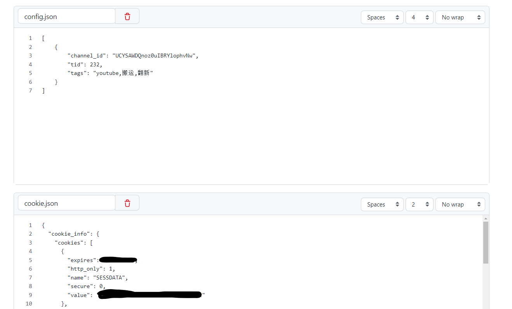
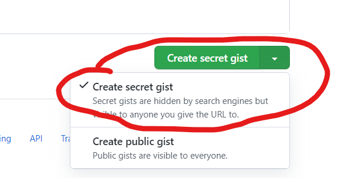
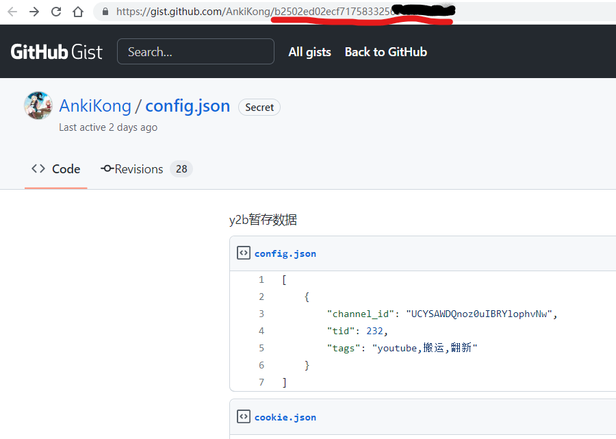
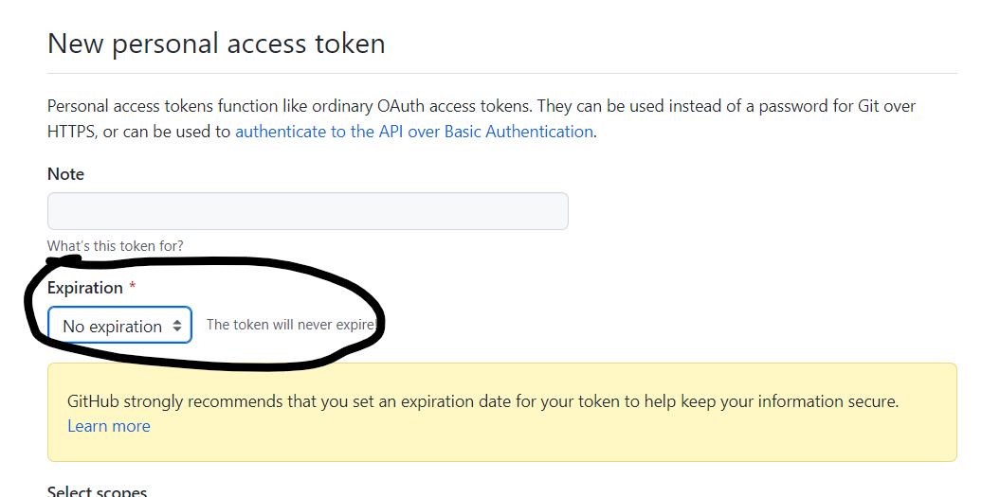
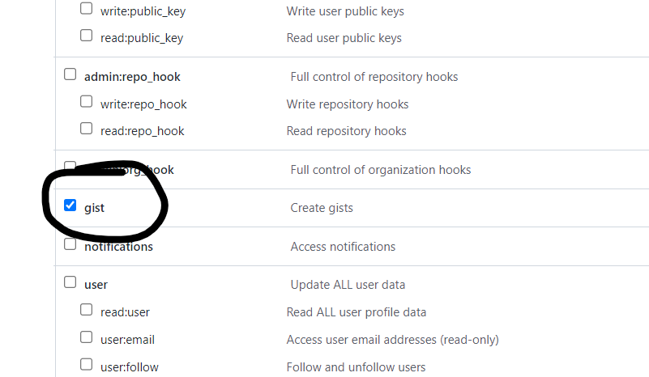
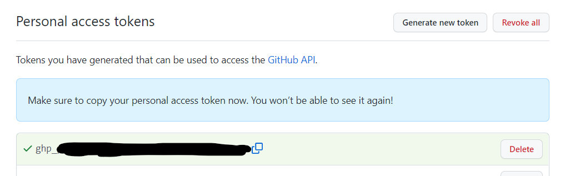
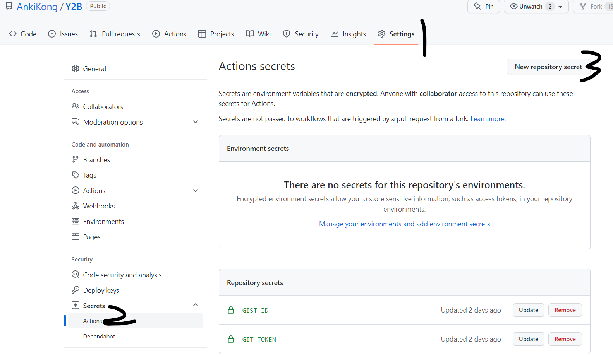
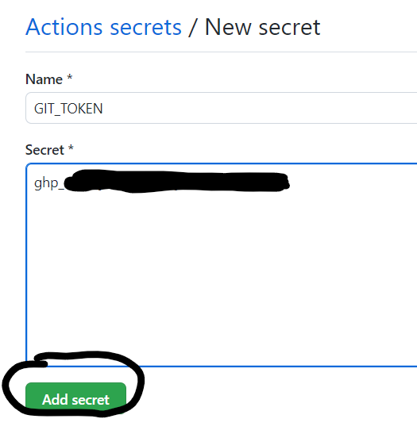
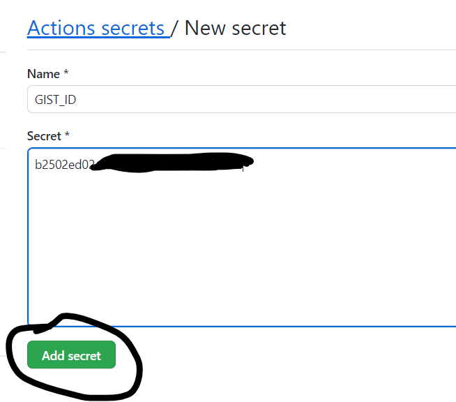
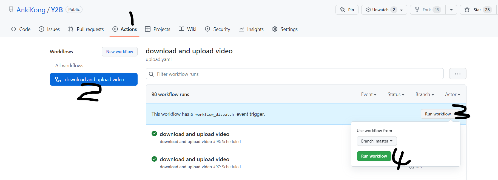

# Y2B

把Youtube上的视频搬运到哔哩哔哩

交流QQ群：**849883545**

## 食用方法

1. 下载 [biliup](https://github.com/ForgQi/biliup-rs/releases)，执行 `biliup login`,登录后会在本地生成一个`cookies.json`
2. 打开 [gist](https://gist.github.com/)
3. 新建一个文件 `config.json`,填下面的json,channel_id就是频道的 id,tid是b站的分区id，tags是最终投递到b站时，填的标签，支持多个频道。接下来就是把第一步生成的 cookies.json 内容，在新增一个 cookie.json (注意，没有 s ),把内容赋值粘贴到里面。

   ``` json
   [
    {
        "channel_id": "UCYSAWDQnoz0uIBRYlophvNw",
        "tid": 232,
        "tags": "youtube,搬运,翻新"
    }
   ]
   ```

4. 完成后效果大概这样子 ，然后保存为 `Create secret gist`，**一定要是 secret 的，不然你的密钥会泄露** 。保存后会跳转到新页面，把 gist id 复制下来，就是划红线的东西 
5. [申请一个 GitHub token](https://github.com/settings/tokens/new),时间选永久，scope勾上gist，然后点击生成,把token复制下来   
6. fork 本仓库
7. 按顺序点进去 
8. 把 gist id 和 token 填进去  
9. 手动触发一下 action ，看看有没有问题 
